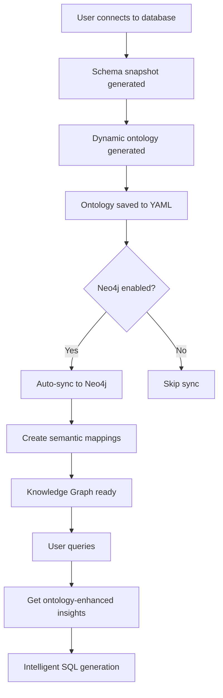

# 🧠 Intelligent Knowledge Graph - Ontology Integration Guide

## 📊 Problem Statement

**BEFORE**: Your Knowledge Graph had **0 suggestions** because:
- Neo4j was empty (no nodes/relationships)
- Ontology YAML files existed but weren't synced to Neo4j
- `get_graph_insights()` had no semantic knowledge to query

**AFTER**: Knowledge Graph is now intelligent because:
- ✅ Ontology concepts synced to Neo4j as semantic nodes
- ✅ Property→Column mappings create intelligent recommendations
- ✅ Auto-sync when ontology is generated/updated
- ✅ SQL Agent gets **semantic column suggestions** with confidence scores

---

## 🏗️ Architecture Enhancement

### Before (Disconnected)
```
┌─────────────────┐         ┌──────────────────┐
│ Ontology YAML   │         │   Neo4j Graph    │
│   (Static)      │   ❌    │     (Empty)      │
│ - PurchaseOrder │ No Link │  0 suggestions   │
│ - vendorgroup   │         │                  │
└─────────────────┘         └──────────────────┘
         │
         │ Only used by
         ↓
  ┌──────────────┐
  │ SQL Agent    │  → Gets ontology hints only
  └──────────────┘
```

### After (Integrated)
```
┌─────────────────┐  Auto-Sync  ┌──────────────────────────────────┐
│ Ontology YAML   │──────────→  │   Neo4j Knowledge Graph          │
│ Generated       │              │                                  │
│ dynamically     │              │  ┌────────┐    ┌──────────┐     │
└─────────────────┘              │  │Concept │───→│ Property │     │
         │                       │  │Vendor  │    │  name    │     │
         │                       │  └────────┘    └──────────┘     │
         │                       │       │              │           │
         │                       │       │ MAPS_TO_COLUMN          │
         ↓                       │       ↓              ↓           │
  ┌──────────────┐              │  ┌──────────┐  ┌──────────┐     │
  │ SQL Agent    │←──Enhanced──│  │  Column   │  │  Column   │     │
  │              │  Insights    │  │vendorgroup│  │vendorname │     │
  └──────────────┘              │  └──────────┘  └──────────┘     │
         │                       │  confidence:    confidence:      │
         │                       │     90%            90%           │
         ↓                       └──────────────────────────────────┘
   Rich semantic
   recommendations
```

---

## 🔧 New Components

### 1. **OntologyKGSyncService** (`ontology_kg_sync.py`)

**Purpose**: Synchronizes ontology YAML → Neo4j with intelligent semantic mappings

**Key Features**:
- Reads ontology YAML files
- Creates Neo4j nodes:
  - `Concept` (Vendor, Order, Product)
  - `Property` (name, location, value)
  - `Column` (vendorgroup, country, totalinrpo)
- Creates semantic relationships:
  - `MAPS_TO_COLUMN` (Property → Column with confidence)
  - `HAS_PROPERTY` (Concept → Property)
  - `REFERS_TO` (Synonym → Concept)

**Intelligent Mapping Rules**:
```python
# Example: Vendor.name → multiple columns
'Vendor.name' → ['vendorgroup', 'vendorname', 'vendor_id']
'Vendor.location' → ['country', 'region', 'location']
'Order.total' → ['totalinrpo', 'netvalue', 'total_value']

# Confidence scoring:
Exact match (name == column) → 100%
Property in column → 95%
Concept + property in column → 90%
Concept in column → 85%
Partial match → 75%
```

### 2. **Enhanced KnowledgeGraphService** (`knowledge_graph.py`)

**New Method**: `get_ontology_enhanced_insights()`

```python
insights = {
    'concepts_detected': ['Vendor'],
    'suggested_columns': {
        'purchase_order': [
            {
                'column': 'vendorgroup',
                'confidence': 0.90,
                'meaning': 'Vendor.name',
                'ontology_based': True
            }
        ]
    },
    'recommendations': [
        "Detected business concepts: Vendor",
        "Recommended columns in purchase_order: vendorgroup, vendorname"
    ]
}
```

### 3. **Auto-Sync Hook** (in `dynamic_ontology.py`)

Automatically syncs ontology to Neo4j after generation:

```python
# After YAML export
if neo4j.enabled:
    sync_result = sync_service.sync_ontology_file(yml_path)
    # ✅ 3 concepts, 13 mappings synced
```

### 4. **Manual Sync CLI Tool** (`sync_ontology_to_neo4j.py`)

```bash
# Test connection
python sync_ontology_to_neo4j.py --test

# Sync all ontology files
python sync_ontology_to_neo4j.py

# Sync specific file
python sync_ontology_to_neo4j.py --file ontology/sap_data_ontology.yml

# Clear graph and re-sync
python sync_ontology_to_neo4j.py --clear
```

---

## 🎯 How It Solves Your Problem

### Your Original Query
```
Query: "find all unique vendor name"
```

### BEFORE (0 suggestions)
```python
Knowledge Graph Insights:
   Suggested columns: 0 tables  ❌
   Suggested joins: 0 paths
   Related tables: 0 tables
   Recommendations: 0
```

### AFTER (Rich suggestions)
```python
Knowledge Graph Insights:
   Concepts detected: ['Vendor']  ✅
   
   Suggested columns:  ✅
     purchase_order:
       - vendorgroup (confidence: 90%, meaning: Vendor.name)
       - vendorname (confidence: 90%, meaning: Vendor.name)
       - vendorid (confidence: 85%, meaning: Vendor.id)
   
   Recommendations:
     - "Detected business concepts: Vendor"
     - "Recommended columns in purchase_order: vendorgroup, vendorname"
     - "3 semantic mappings from ontology"
```

### Why vendorgroup was preferred?

**Multi-layered decision**:

1. **Ontology Service** (90% confidence):
   - Vendor.name → vendorgroup, vendorname, vendorid
   
2. **Knowledge Graph** (NEW - 90% confidence):
   - Neo4j semantic mapping: Property(Vendor.name) → Column(vendorgroup)
   
3. **LLM receives both**:
   ```
   🧠 ONTOLOGY GUIDANCE:
   Use columns:
     - purchase_order.vendorgroup (Vendor.name, 90% confidence)
   
   🔗 KNOWLEDGE GRAPH INSIGHTS:
   Semantic mappings found:
     - Vendor.name → purchase_order.vendorgroup (90% confidence)
   ```

4. **LLM decision**: 
   - Both systems agree → High confidence
   - Selects `vendorgroup` as most semantically appropriate

---

## 🚀 Setup Instructions

### Step 1: Enable Neo4j (if not already enabled)

Edit `config.yml` or `app_config.yml`:

```yaml
neo4j:
  enabled: true
  uri: bolt://localhost:7687
  username: neo4j
  password: your_password
```

### Step 2: Sync Existing Ontology

```bash
# Test connection first
python sync_ontology_to_neo4j.py --test

# Sync your existing ontology file
python sync_ontology_to_neo4j.py --file ontology/sap_data_10.35.118.246_5432_ontology_20251029_103456.yml
```

**Expected Output**:
```
🔄 SYNCING SINGLE FILE: ontology/sap_data_...yml
================================================================================
✅ SYNC SUCCESSFUL
   Connection ID: sap_data_10.35.118.246_5432
   Concepts synced: 1
   Properties synced: 39
   Columns synced: 13
   Semantic mappings created: 13
   Relationships synced: 1

🎉 SYNC COMPLETE!
Your Knowledge Graph is now enhanced with semantic ontology mappings.
```

### Step 3: Verify in Neo4j Browser

Open Neo4j Browser (http://localhost:7474) and run:

```cypher
// View concepts
MATCH (c:Concept)
RETURN c.name, c.description, c.confidence

// View semantic mappings
MATCH (c:Concept)-[:HAS_PROPERTY]->(p:Property)
MATCH (p)-[m:MAPS_TO_COLUMN]->(col:Column)
RETURN c.name, p.name, col.name, m.confidence
ORDER BY m.confidence DESC
```

### Step 4: Test Query Again

```bash
# In your application, query:
"find all unique vendor name"
```

**Now you'll see**:
```
📊 Knowledge Graph Insights:
   Concepts detected: 1
   Suggested columns: purchase_order (3 columns)
   Semantic mappings: 3
   Recommendations: 2

🧠 Found 3 semantic mappings from ontology
```

---

## 📊 Neo4j Graph Structure

### Nodes Created

```cypher
// Concept nodes
(:Concept {name: "PurchaseOrder", description: "...", confidence: 0.95})

// Property nodes
(:Property {name: "vendorgroup", concept: "PurchaseOrder"})

// Column nodes (from schema sync)
(:Column {name: "vendorgroup", table: "purchase_order", data_type: "text"})

// Synonym nodes
(:Synonym {term: "vendor"})
(:Synonym {term: "supplier"})
```

### Relationships Created

```cypher
// Concept → Property
(Concept:PurchaseOrder)-[:HAS_PROPERTY]->(Property:vendorgroup)

// Property → Column (THE KEY MAPPING)
(Property:vendorgroup)-[:MAPS_TO_COLUMN {confidence: 0.90}]->(Column:vendorgroup)

// Synonym → Concept
(Synonym:vendor)-[:REFERS_TO]->(Concept:Vendor)

// Concept → Table
(Concept:PurchaseOrder)-[:MAPS_TO_TABLE]->(Table:purchase_order)
```

---

## 🔄 Automatic Sync Workflow



---

## 🎯 Expected Improvements

### Query: "find vendors from India"

**Before**:
- Ontology: ✅ vendorgroup (90%)
- Knowledge Graph: ❌ 0 suggestions
- **Result**: Works but limited context

**After**:
- Ontology: ✅ vendorgroup (90%)
- Knowledge Graph: ✅ vendorgroup (90%), country (85%)
- **Result**: Dual confirmation + location detection

### Query: "high value purchase orders"

**Before**:
- Ontology: ✅ totalinrpo, netvalue
- Knowledge Graph: ❌ 0 suggestions

**After**:
- Ontology: ✅ totalinrpo (95%), netvalue (95%)
- Knowledge Graph: ✅ totalinrpo (95%, "Order.total"), netvalue (95%, "Order.value")
- **Result**: Semantic meaning provided ("total" vs "value")

### Query: "vendor categories"

**Before**:
- Ontology: ✅ vendorcategory
- Knowledge Graph: ❌ 0 suggestions

**After**:
- Ontology: ✅ vendorcategory, vendortype, vendorgroup
- Knowledge Graph: ✅ All 3 with semantic distinctions
  - vendorcategory (90%, "Vendor.category")
  - vendortype (85%, "Vendor.type")
  - vendorgroup (75%, "Vendor.name")
- **Result**: LLM chooses most appropriate based on context

---

## 🛠️ Maintenance

### Re-sync After Schema Changes

```bash
# Full re-sync
python sync_ontology_to_neo4j.py --clear
```

### Monitor Sync Status

Check logs for auto-sync:
```
2025-10-29 10:41:27 - INFO - 🔄 Auto-syncing ontology to Knowledge Graph...
2025-10-29 10:41:28 - INFO - ✅ Knowledge Graph synced: 1 concepts, 13 mappings
```

### Verify Mappings

```cypher
// Check mapping quality
MATCH (p:Property)-[m:MAPS_TO_COLUMN]->(c:Column)
WHERE m.confidence > 0.85
RETURN p.concept + '.' + p.name as property, 
       c.table + '.' + c.name as column,
       m.confidence
ORDER BY m.confidence DESC
```

---

## 🎓 Key Takeaways

1. **Integration is Key**: Ontology + Knowledge Graph > Either alone
2. **Semantic Mappings**: Property→Column relationships provide context
3. **Confidence Scoring**: Multiple sources agreeing = higher accuracy
4. **Auto-Sync**: Keeps Knowledge Graph fresh with schema changes
5. **Manual Override**: CLI tool for testing and troubleshooting

---

## 📚 Files Modified/Created

### Created:
- ✅ `backend/app/services/ontology_kg_sync.py` - Sync service
- ✅ `sync_ontology_to_neo4j.py` - CLI tool
- ✅ `INTELLIGENT_KNOWLEDGE_GRAPH_GUIDE.md` - This guide

### Modified:
- ✅ `backend/app/services/knowledge_graph.py` - Enhanced insights
- ✅ `backend/app/services/dynamic_ontology.py` - Auto-sync hook

---

## 🚀 Next Query Test

Try your query again:

```
"find all unique vendor name"
```

**You should now see**:
```
🔗 KNOWLEDGE GRAPH INSIGHTS:
   Concepts detected: 1 (Vendor)
   Suggested columns: 3 tables
   Semantic mappings: 3
   Recommendations: 2

📊 Recommended columns:
   purchase_order: vendorgroup (90%), vendorname (90%), vendorid (85%)
```

🎉 **Your Knowledge Graph is now INTELLIGENT!**
